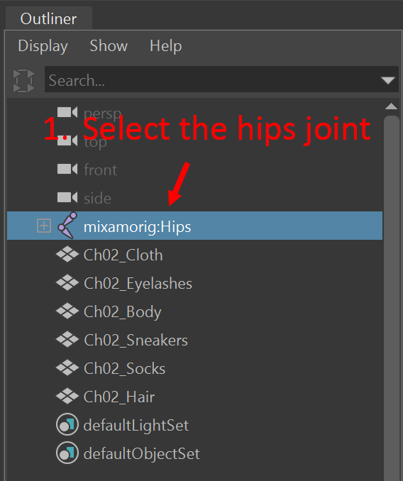
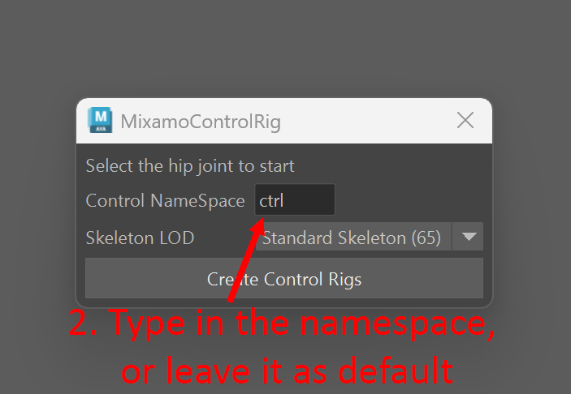
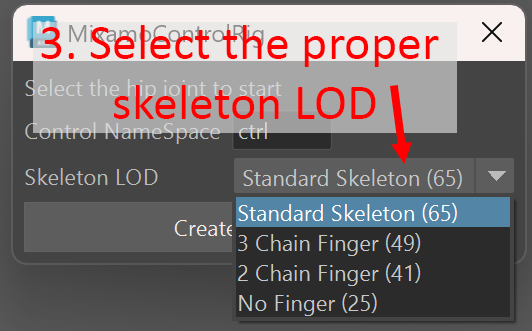
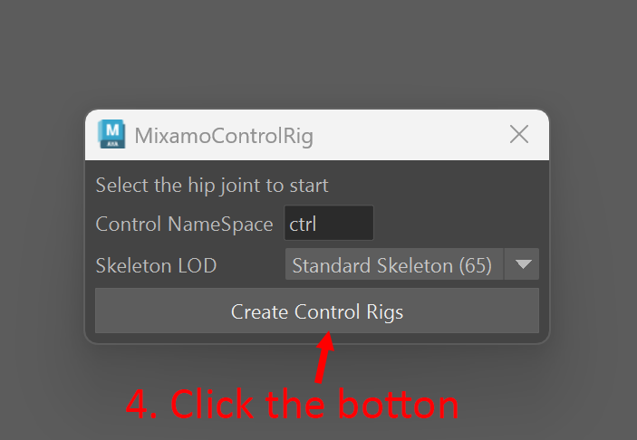

# Maya-Mixamo-Control-Rigs

## Introduction
MixamoControlRigs is an unofficial tool that automatically generates control rigs for [Mixamo](https://www.mixamo.com) characters, enabling faster posing and prototyping workflows.

While an official tool [Mixamo Maya-Auto-Control-Rig](https://academicphoenix.gumroad.com/l/MixamoAutoRig) exists, it was written in Python 2 and no longer work since Maya fully switched to Python 3 starting with version 2023.

This tool works for both Mixamo pre-defined characters and custom characters rigged using Mixamo Auto Rigger.

## Requirement
Maya 2023 or later.

This tool has only been tested on Windows 11 so far, and it may or may not work on other operating systems.

## Installation
1. Download **MixamoControlRig_v1.0.0.zip** from the [latest release](https://github.com/lexikong/maya-mixamo-control-rig/releases).
    * Note: If you clone from this git repository, you need to re-organize the folder structure manually, see the comment section in [installMixamoControlRig.py](installMixamoControlRig.py)  
2. Unzip it to a preferred location.
3. Open Maya.
4. Drag and drop install_mixamoControlRig.py to the viewport.

## How To Use
1. Select the hips joint of the character  
   
2. Enter the namespace in which the control rigs will be created (or leave it as default "ctrl")  
   
3. Select the proper skeleton LOD from the drop-down menu
    * If the character is a Mixamo pre-defined character, keep it as default(Standard Skeleton)
    * If you upload your own character to Mixamo Auto Rigger, choose the same option as you rig the character(by default it is Standard Skeleton as well)  
   
4. Click the **Create Control Rigs** button  
   

## Known Issues
1. The character's mesh may cover the control rigs if the character is bulky. A workaround is to switch to wireframe mode(by hitting '4').

## Issue Reporting
File a new issue [here](https://github.com/lexikong/Maya-Mixamo-Control-Rigs/issues)

## Licensing
This tool is licensed under MIT License.
